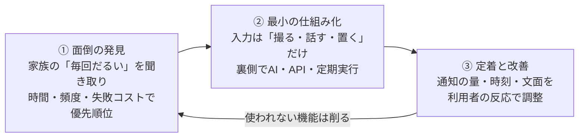

# AI Life Automation Showcase

**生活の「面倒」を見つけて、AIで仕組みに変える。**
約3ヶ月（2026年5月末〜）で16の自動化システムを構築し、家族の日常業務として運用しているものの紹介ページです。

> 私はプログラマーではありません。コードはすべて AI（[Claude Code](https://claude.com/claude-code)）に生成させ、私は **課題の整理・要件定義・設計・動作検証・運用と改善** を担当しています。このリポジトリは「何を解決し、どう動いているか」を読み手に確認してもらうためのもので、個人情報を含む実データや設定値は一切含めていません。

| | |
|---|---|
| 稼働中の自動化システム | **16** |
| 自動実行される定期タスク | **39本**（毎朝・毎晩・毎週・毎月） |
| 再利用できる業務スキル（手順書化した自動化） | **22** |
| 構築期間 | **約3ヶ月**（2026-05-27 〜） |

---

## 進め方 —— 作って終わりにせず「使われ続ける」まで面倒を見る

---

## 代表的な自動化事例

| # | システム | 解決した面倒 | 詳細 | 触れるデモ |
|---|---|---|---|---|
| 1 | 家計簿の自動仕分け・転記 | 毎月数百件の明細を手で分類・転記 | [systems/01-household-ledger.md](systems/01-household-ledger.md) | [▶ 試す](https://nihonbare1979-cmd.github.io/ai-life-automation-showcase/demos/01-household-ledger/) |
| 2 | 妻の不動産事業の経理自動化 | 領収書・カード明細の記帳と月次の締め | [systems/02-rental-accounting.md](systems/02-rental-accounting.md) | [▶ 試す](https://nihonbare1979-cmd.github.io/ai-life-automation-showcase/demos/02-rental-accounting/) |
| 3 | 物件情報の巡回監視Bot | 複数の不動産サイトを毎日目視巡回 | [systems/03-property-watch.md](systems/03-property-watch.md) | [▶ 試す](https://nihonbare1979-cmd.github.io/ai-life-automation-showcase/demos/03-property-watch/) |
| 4 | 家庭の不用品を「写真1枚」で自動出品 | 撮影・説明文・相場調査・3サイト入力 | [systems/04-flea-market-autolist.md](systems/04-flea-market-autolist.md) | [▶ 試す](https://nihonbare1979-cmd.github.io/ai-life-automation-showcase/demos/04-flea-market-autolist/) |
| 5 | AI音声ニュース番組の毎朝自動生成 | 朝の情報収集時間 | [systems/05-ai-radio.md](systems/05-ai-radio.md) | [▶ 音声を聴く](https://nihonbare1979-cmd.github.io/ai-life-automation-showcase/demos/05-ai-radio/) |
| 6 | 3Dスキャン → 寸法入り図面の自動生成 | 築古物件の測量・作図 | [systems/06-scan-to-floorplan.md](systems/06-scan-to-floorplan.md)（[フルソース公開リポジトリ](https://github.com/nihonbare1979-cmd/scan-to-floorplan-skill)） | [▶ 試す](https://nihonbare1979-cmd.github.io/ai-life-automation-showcase/demos/06-floorplan-editor/) |

各ページの構成は共通です：**課題 → 仕組み（図）→ 効果（実測値）→ 使用技術 → コード抜粋（機密値を除去した核心部分のみ）→ 出力サンプル（マスク済み）**

---

## 触って試せるデモ

各事例には、ブラウザでそのまま操作できるデモを用意しています（GitHub Pages）。**本番のロジックを移植した部分**と、**AI呼び出しなど公開できない部分を事前計算で再現した部分**は、各デモの冒頭に明記しています。

| デモ | 中身 | 本物度 |
|---|---|---|
| [物件情報の巡回監視Bot](https://nihonbare1979-cmd.github.io/ai-life-automation-showcase/demos/03-property-watch/) | 価格を書き換えて「巡回を実行」→ 新着・値下げを検知しLINE通知文を生成 | 差分検知ロジックを本番からそのまま移植 |
| [家計簿の自動仕分け](https://nihonbare1979-cmd.github.io/ai-life-automation-showcase/demos/01-household-ledger/) | 明細を編集して「仕分けを実行」→ 分類・転記・差分レポート | 収入分類ルールを本番から移植（辞書は縮小サンプル） |
| [領収書の経理台帳化](https://nihonbare1979-cmd.github.io/ai-life-automation-showcase/demos/02-rental-accounting/) | 領収書を投入 → AI読取 → 消し込み → 台帳 → ボード更新 | 消し込みロジックは本番同等、AI読取結果は事前計算 |
| [不用品の自動出品](https://nihonbare1979-cmd.github.io/ai-life-automation-showcase/demos/04-flea-market-autolist/) | 元写真 → AI分析 → 構図調整（前後比較）→ サムネイル → 3サイト入力 | 画像・商品情報はすべて本物の生成物、フォームは再現 |
| [AI音声番組の実物サンプル](https://nihonbare1979-cmd.github.io/ai-life-automation-showcase/demos/05-ai-radio/) | 実際に配信した番組から、個人情報を含まない75秒を切り出して再生 | 本物の生成音声（2話者TTS＋自動品質検証を通過したもの） |
| [間取りエディタ](https://nihonbare1979-cmd.github.io/ai-life-automation-showcase/demos/06-floorplan-editor/) | 3Dスキャンの点群を下敷きに部屋を動かせる | 本番のツールそのもの（物件名のみ置換） |

---

## その他の稼働中システム（抜粋）

- 学校からのメール・紙プリントを自動でカレンダー登録＋夜のダイジェスト配信
- 子供のテスト写真から弱点を分析し、週次ドリルPDFを自動生成（第10回まで継続）
- 地域イベント × 家族の休みを照合し、週1回おでかけ提案
- 高配当株の買付計画を毎月自動生成（発注のみ本人）
- 家計実績から FIRE ライフプランシートを対話生成
- 三交代シフトに連動した「やりたいこと」の自動予定化
- Siri 音声メモ → タスク化＋受領報告（外出先から指示）
- 料理動画のカット・テロップ・BGM を自動編集
- 夫婦の月例予定を候補日抽出 → 調整表まで自動化
- 複数 AI エージェントの役割分担と作業記録の共有基盤

---

## AIと組み合わせて使ってきた技術・サービス

`Python` `Claude Code / Claude API` `Gemini API（Vision・TTS）` `Google Sheets / Drive / Calendar / Gmail / Tasks API` `Google Apps Script` `LINE Messaging API` `ブラウザ自動操作（Chrome）` `OCR・画像処理` `ffmpeg（音声・動画）` `Blender Python` `launchd / cron 定期実行` `iOS ショートカット` `Git / GitHub`

---

## このリポジトリの方針

- **個人情報・機密値は含めません。** 実データ、API キー、各種 ID、家族の氏名・住所・金額などは掲載せず、コード抜粋内の該当箇所は `<<REDACTED>>` に置き換えています
- **コードは抜粋のみ。** フルソースは掲載していません（フルソース公開の実例は [scan-to-floorplan-skill](https://github.com/nihonbare1979-cmd/scan-to-floorplan-skill) を参照してください）
- 掲載している数字は、各システムのログ・記録から拾った実測値です

---

*すべて業務外の個人活動として、本人が Claude Code を用いて設計・構築・運用したものです。連絡先: nihonbare1979@gmail.com*
