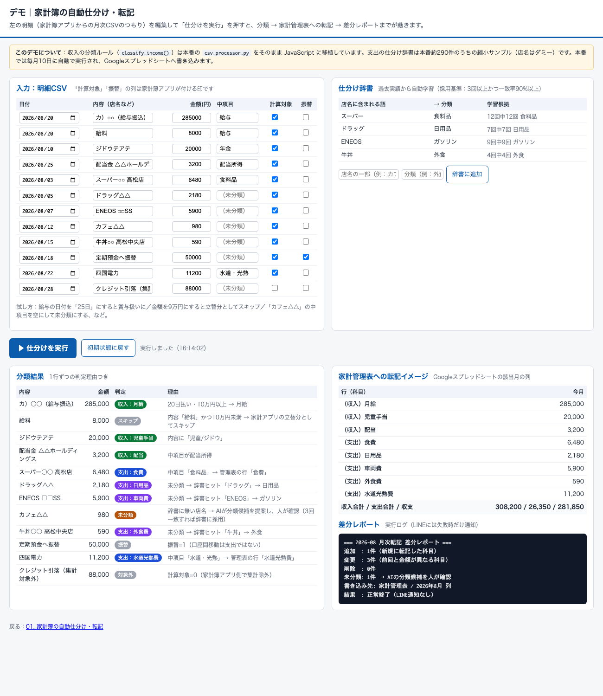
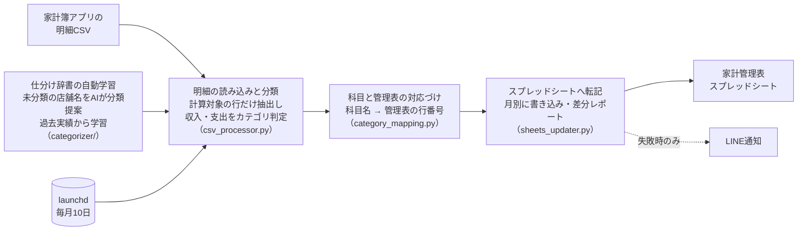

# 01. 家計簿の自動仕分け・転記

| 項目 | 内容 |
|---|---|
| 状態 | 稼働中（毎月10日に自動実行・毎晩の仕分け学習） |
| 利用者 | 本人・妻（家計の共有） |
| 入力 | 家計簿アプリ（マネーフォワード ME）の明細CSV |
| 出力 | Googleスプレッドシートの家計管理表（月別集計）＋ 週次のLINE報告 |

> ### ▶ [触って試せるデモを開く](https://nihonbare1979-cmd.github.io/ai-life-automation-showcase/demos/01-household-ledger/)
> サンプル明細を編集して「仕分けを実行」すると、本番の収入分類ルールを移植したロジックで分類 → 管理表への転記イメージ → 差分レポートまで動きます。
> （GitHub Pages で公開。リポジトリ内のファイルは [`demos/01-household-ledger/`](../demos/01-household-ledger/index.html)）

## 実際の画面



*デモ画面：分類結果（判定理由つき）と管理表への転記イメージ、差分レポート*


## 課題

毎月数百件のカード・銀行明細を、家計簿アプリ上で手で分類し、さらに家計管理表（スプレッドシート）へ転記していました。1回あたり1〜2時間、しかも月をまたぐと「どこまでやったか」が分からなくなる、典型的な**やる気に依存する定型作業**でした。

## 仕組み



- **仕分け辞書の自動学習**：未分類の店舗名は、過去の実績から「3回以上出現し、同じ分類が90%以上」のものだけを辞書に採用します（誤学習を防ぐための採用基準）。現在の辞書は約290件
- **差分レポート**：前回転記との「追加・変更・削除」を出力し、転記ミスや二重計上を検知できるようにしています
- **失敗時だけ通知**：正常時は静かに終わり、失敗したときだけLINEが届く設計（通知疲れを防ぐ）

## 効果（実測）

- 月次の転記作業が**全自動化**（人がやるのは月1回、CSVを所定フォルダに置くだけ）
- 未分類明細の**約4割**を辞書が自動吸収、55件の一括再分類にも対応
- 家計の締めが「月10日に自動で終わっている」状態になり、夫婦で同じ数字を見て話せるようになった

## 使用技術

`Python` `Google Sheets API` `ブラウザ自動操作（分類作業の代行）` `launchd定期実行` `LINE Messaging API（失敗通知）`

## コード抜粋 —— 収入の自動分類ロジック（`csv_processor.py`）

「給与」という同じ科目でも、支払日と金額で月給と賞与を見分ける、実データで検証して決めたルールです。

```python
def classify_income(row: dict) -> Optional[int]:
    """
    収入行を分類してスプレッドシート行番号を返す。
    判定できない場合は None を返す。

    給与の振り分けルール（実データ 1年分で検証済み）:
      月給: 18〜24日払い かつ 10万円以上
      賞与: 月末・月初の大きい金額
      スキップ: 内容「給料」の小額 = 家計アプリの立替分（±ゼロ）
    """
    middle = row.get("中項目", "").strip()
    content = row.get("内容", "").strip()
    date_str = row.get("日付", "").strip()
    amount_str = row.get("金額（円）", "").strip()

    if middle == "ポイント":
        return INCOME_ROWS["point"]

    if middle == "給与":
        amount = parse_amount(amount_str)
        if content == "給料" and amount < 100_000:
            return None
        try:
            date = datetime.strptime(date_str, "%Y/%m/%d")
            if 18 <= date.day <= 24 and amount >= 100_000:
                return INCOME_ROWS["salary_monthly"]
            else:
                return INCOME_ROWS["salary_bonus"]
        except ValueError:
            return INCOME_ROWS["salary_monthly"]

    if middle == "年金":
        if "ジドウ" in content or "児童" in content:
            return INCOME_ROWS["children_grant"]
        return INCOME_ROWS["temporary"]

    if middle in ("不動産所得", "事業・副業", "メルカリ"):
        return INCOME_ROWS["side_job"]
    if middle == "配当所得":
        return INCOME_ROWS["dividend"]
    if middle in ("その他入金", "一時所得", "臨時収入"):
        return INCOME_ROWS["temporary"]
    if middle in ("株式投資", "投資"):
        return INCOME_ROWS["investment"]

    return None  # 分類不能 → 人が判断する
```

## 出力サンプル

実際の出力先はスプレッドシートのため、ここでは**差分レポートの形式**をダミー値で示します。

```
=== 2026-XX 月次転記 差分レポート ===
追加  : 12件（新規に転記した明細）
変更  :  3件（金額または分類が前回と異なる）
削除  :  0件
未分類:  5件 → 分類候補をAIが提案済み（要確認）
書き込み先: 家計管理表 / 2026年XX月 シート
```

## 運用して学んだこと

- 最初は「全部自動で分類」を目指しましたが、誤分類の修正コストの方が高かったため、**確度の高いものだけ自動・残りは人が確認**に切り替えました。自動化率より「信頼して任せられること」が定着の条件でした
- 通知は「失敗時だけ」に絞ってから、妻が通知を無視しなくなりました
