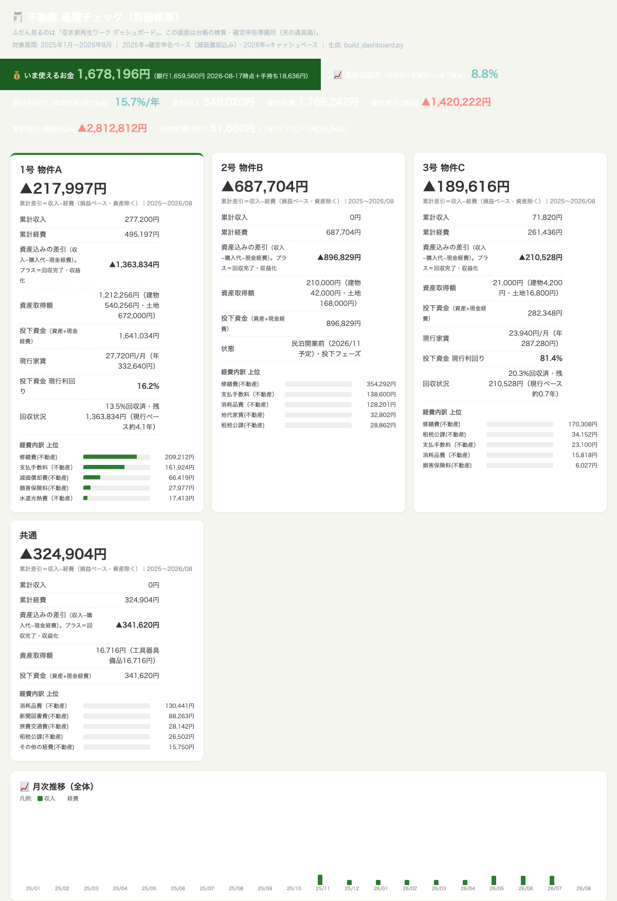
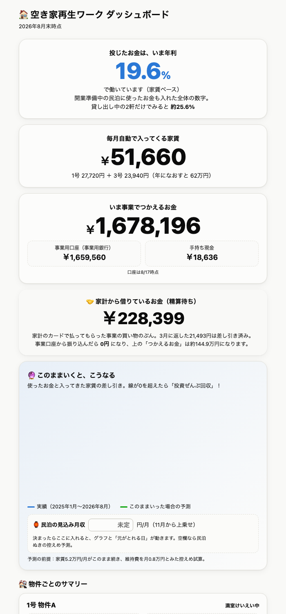
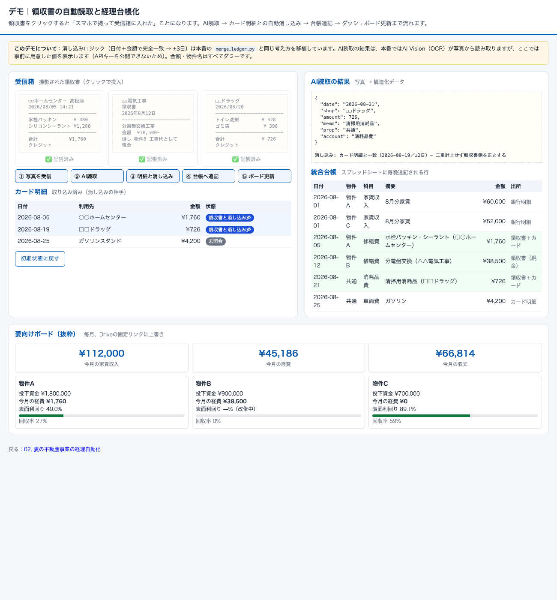
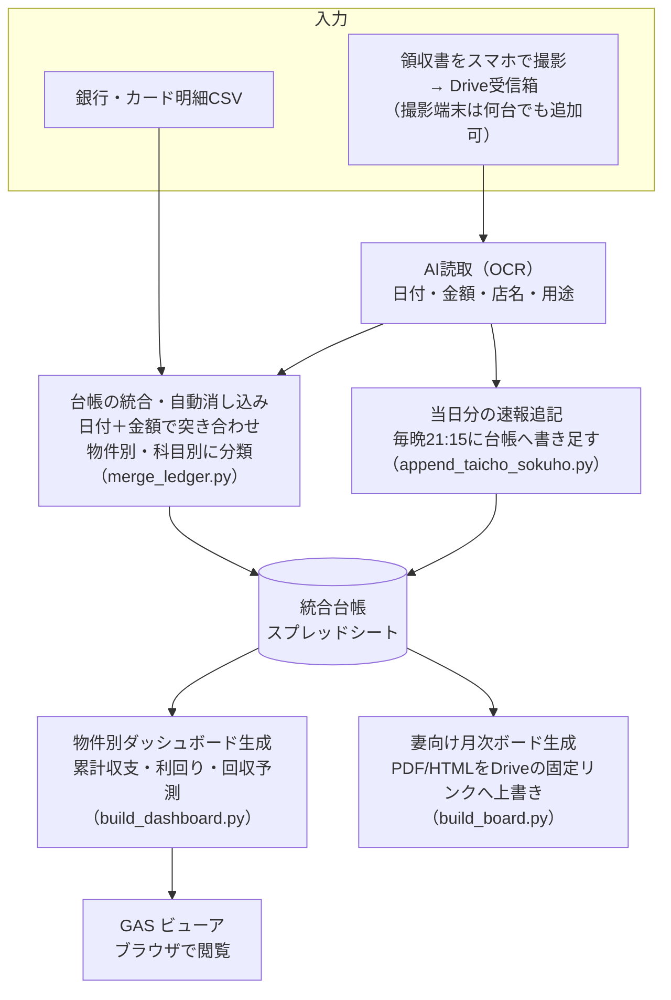

# 02. 妻の不動産事業の経理自動化

| 項目 | 内容 |
|---|---|
| 状態 | 稼働中・日々改善（毎晩21:15に自動記帳／毎月10日に月次更新） |
| 利用者 | 妻（事業主）・本人（無償の経理担当） |
| 入力 | スマホで撮った領収書の写真（撮影端末は複数台）、銀行・カード明細CSV |
| 出力 | 統合台帳（スプレッドシート）、物件別ダッシュボード、妻向けの月次ボード（PDF/HTML） |

> ### ▶ [触って試せるデモを開く](https://nihonbare1979-cmd.github.io/ai-life-automation-showcase/demos/02-rental-accounting/)
> 領収書をクリックして投入すると、AI読取 → カード明細との消し込み（本番と同じ日付＋金額のロジック）→ 台帳追記 → ボード更新まで流れます。
> （GitHub Pages で公開。リポジトリ内のファイルは [`demos/02-rental-accounting/`](../demos/02-rental-accounting/index.html)）

## 実際の画面



*実際の経理ダッシュボード（物件名は物件A/B/Cに置換、金額は一定比率でスケール済み。構成・項目は本物）*



*妻向けの月次ボード（同じく匿名化済み）。難しい帳票ではなく「今いくら使えるか」「年利いくらか」だけを大きく見せる*



*デモ画面：領収書3枚を投入した後の台帳とボード*


## 課題

妻が営む小規模な不動産賃貸事業では、領収書・カード明細・銀行明細という**3つの出所の情報**を突き合わせて台帳にまとめる必要があり、月次の締めが常に遅れていました。私が経理を手伝っていましたが、手作業では「どの領収書がどのカード明細に対応するか」の消し込みに時間を取られていました。

## 仕組み



- **人がやることは「撮る」だけ**：領収書をスマホで撮って受信箱に入れれば、読取から記帳まで自動。**撮影端末は妻と私の2台のスマホで運用中**で、同じ手順のまま端末を何台でも増やせます（例：企業なら現場ごとの担当者がそれぞれのスマホで撮るだけで、1つの台帳に集約できます）
- **3ソースの自動消し込み**：領収書とカード明細のように同じ支出が複数の出所に現れるものを、日付と金額で突き合わせて二重計上を防ぎます（完全一致 → ±3日の順で探索）
- **速報と確定の2段階**：毎晩の速報追記で「今日の分はもう台帳に入っている」状態を作り、月次で確定処理
- **妻向けの出口を分ける**：詳細な経理帳票は本人（検算用）、妻には月次ボード（見たい数字だけ）を固定リンクで配布。**リンクが変わらない**ので妻はブックマーク1つで済む

## 効果（実測）

- 紙の領収書**93ページ分**をAI並列処理で**約10分**で台帳化
- 統合台帳は183行 → 274行と成長しながら、毎晩の自動記帳で締め作業が消滅
- 不具合や新しい明細パターンが出るたびに改善しており、2026年6月の稼働開始から継続的にアップデート中

## 使用技術

`Python` `AI Vision（領収書の読取）` `Google Apps Script（ビューア）` `Google Drive / Sheets API` `launchd定期実行` `LINE Messaging API（月次リマインド）`

## コード抜粋 —— 日付＋金額による自動消し込み（`merge_ledger.py`）

会計の突合でよく使う「まず完全一致、なければ数日の誤差を許して探す」というロジックです。

```python
def consume(pool, amt, dt, tols=(0, 3), extra=None):
    """日付+金額で未使用の1件を消し込む(完全一致→±3日)。extra=追加フィルタ関数"""
    for tol in tols:
        for x in pool:
            if x["_used"] is None and x["_amt"] == amt and days_between(x["日付"], dt) <= tol \
               and (extra is None or extra(x)):
                x["_used"] = True
                return x
    return None
```

金額の表示ユーティリティ（`build_dashboard.py`）。マイナスを「▲」で示す会計表記に合わせています。

```python
def yen(v, sign=False):
    s = f"{abs(v):,}"
    if sign:
        return ("+" if v >= 0 else "▲") + s
    return ("▲" if v < 0 else "") + s
```

## 出力サンプル

実際のダッシュボード・月次ボードは上の「実際の画面」に掲載しています（物件名を置換し、金額は一定比率で縮小）。物件カードの構成をテキストでも示します。

```
┌ 物件A ────────────────────────┐
│ 累計収入   1,234,000   累計支出  ▲987,000 │
│ 投下資金   2,000,000   回収率       12.3% │
│ 表面利回り     8.9%   回収予測   2032年   │
│ 直近3ヶ月: ■■■□□□  （収支の推移バー）   │
└──────────────────────────────┘
```

## 運用して学んだこと

- 「全部を1つの画面に」ではなく、**見る人ごとに出口を分ける**（事業主には月次ボード、経理担当には検算帳票）ことで、妻が数字を見る習慣が定着しました
- 明細のパターンは毎月増えるため、「完成」はありません。**不具合が出たらその日のうちに直す**運用を続けています
