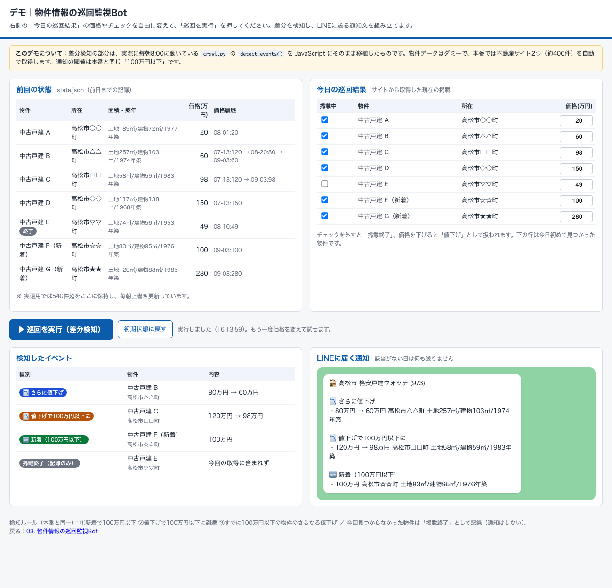
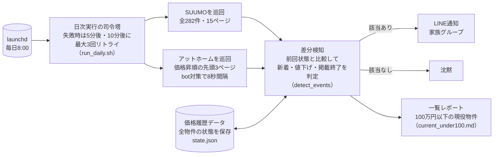

# 03. 物件情報の巡回監視Bot

| 項目 | 内容 |
|---|---|
| 状態 | 稼働中（毎日8:00自動実行・2026年7月13日〜） |
| 利用者 | 本人・妻 |
| 入力 | なし（完全自動） |
| 出力 | 新着・値下げのLINE通知、監視中物件の一覧レポート |

> ### ▶ [触って試せるデモを開く](https://nihonbare1979-cmd.github.io/ai-life-automation-showcase/demos/03-property-watch/)
> 「今日の巡回結果」の価格や掲載チェックを変えて「巡回を実行」すると、本番の差分検知コードを移植したロジックが新着・値下げ・掲載終了を判定し、LINE通知文を組み立てます。
> （GitHub Pages で公開。リポジトリ内のファイルは [`demos/03-property-watch/`](../demos/03-property-watch/index.html)）

## 実際の画面



*デモ画面：差分検知の結果とLINEに届く通知文*


## 課題

高松市内の格安戸建（100万円以下）を探すために、不動産サイト2つを毎日目視で巡回していました。件数が多く（約400件）、「昨日と何が変わったか」を人の記憶で判断するのは限界がありました。

## 仕組み



- **3種類のイベントだけ通知**：①新着で100万円以下 ②値下げで100万円以下に到達 ③すでに100万円以下の物件のさらなる値下げ。該当がない日は何も送らない
- **AIを使わない設計**：クロールと差分検知は素のPythonだけで完結。以前はAIセッションを毎朝起動していましたが、「正常な日も固定費がかかる」ため、**AI不要の部分はAIを外す**判断をしました
- **朝のネット切断への耐性**：8時台に回線が不安定になり6回空振りした経験から、リトライ機構を追加（2026年8月）

## 効果（実測）

- 日次の巡回作業が**ゼロ**に
- 追跡物件**540件**、うち100万円以下の現役物件12件を常時把握（2026年9月時点）
- 運用コスト**ゼロ円**（AIを起動しない・外部サービス課金なし）

## 使用技術

`Python（標準ライブラリ＋curl）` `LINE Messaging API` `差分検知（状態ファイル方式）` `launchd定期実行`

## コード抜粋 —— 差分検知の核心（`crawl.py`）

前回の状態と今回の取得結果を突き合わせ、「新着」「100万円ラインを下回った」「さらに値下げ」「掲載終了」を判定します。

```python
def detect_events(state, current, today):
    """イベント一覧と更新済みstateを返す"""
    known = state["properties"]
    events = []  # (kind, key, info, old_price)

    for key, info in current.items():
        if key not in known:
            rec = dict(info)
            rec["first_seen"] = today
            rec["last_seen"] = today
            rec["active"] = True
            rec["price_history"] = [[today, info["price_man"]]]
            known[key] = rec
            if info["price_man"] <= THRESHOLD_MAN:
                events.append(("new", key, info, None))
        else:
            rec = known[key]
            old_price = rec["price_man"]
            rec["last_seen"] = today
            rec["active"] = True
            rec.pop("delisted", None)  # 再掲載
            if info["price_man"] != old_price:
                rec["price_history"].append([today, info["price_man"]])
                rec["price_man"] = info["price_man"]
                if info["price_man"] < old_price:
                    if old_price > THRESHOLD_MAN >= info["price_man"]:
                        events.append(("cross", key, info, old_price))
                    elif old_price <= THRESHOLD_MAN:
                        events.append(("drop", key, info, old_price))
            for f in ("title", "address", "station", "land", "building",
                      "madori", "built", "url"):
                rec[f] = info[f]

    # 今回見つからなかった物件は掲載終了扱い（両ソースとも取得成功時のみ呼ばれる前提）
    seen_sources = {info["source"] for info in current.values()}
    for key, rec in known.items():
        if key not in current and rec.get("active") and rec["source"] in seen_sources:
            rec["active"] = False
            rec["delisted"] = today
    return events
```

## 出力サンプル

LINE通知の形式（内容はダミー）：

```
🏚 高松市 格安戸建ウォッチ (9/3)

🆕 新着（100万円以下）
・80万円 高松市○○町 土地117㎡/建物78㎡/1978年築

📉 値下げで100万円以下に
・120万円 → 98万円 高松市△△町 土地58㎡/建物58㎡/1983年築
```

毎回上書きされる一覧レポート（`current_under100.md`）の形式。掲載サイト上の公開情報のみで構成され、個人情報は含みません（ここでは住所を町名までに丸めています）：

```
# 高松市 100万円以下の戸建一覧（2026-09-03 時点・12件）
- 20万円  国分寺町  土地189㎡/建物72㎡/1977年築（築49年）
- 40万円  生島町    土地257㎡/建物103㎡/1974年築（築51年）
- 49万円  亀水町    土地117㎡/建物138㎡/1968年築（築57年）
- 80万円  紙町      土地74㎡/建物56㎡/1953年築（築73年）
- 98万円  屋島中町  土地58㎡/建物59㎡/1983年築（築43年）
...
```

## 運用して学んだこと

- 「毎日何か送る」より**「該当がある日だけ送る」**方が、通知が読まれ続けます
- サイトごとに掲載の厚みが違う（片方が100万円以下の物件で8倍多い）ことが分かり、巡回範囲を実測で調整しました。**最初から完璧な設計をせず、動かして測って直す**方が早いです
