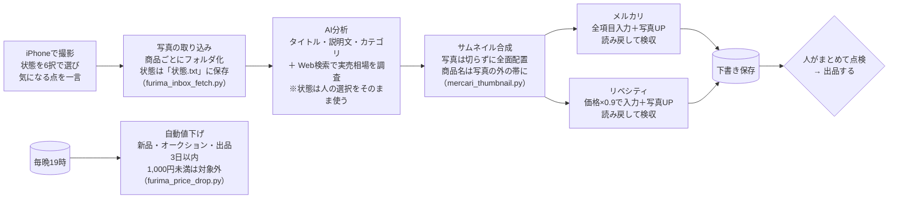

# 04. 不用品販売を「撮る・選ぶ」だけで下書きまで自動化

| 項目 | 内容 |
|---|---|
| 状態 | 稼働中（出品はオンデマンド／値下げは毎晩） |
| 利用者 | 本人・妻 |
| 入力 | iPhoneで撮った商品写真＋商品の状態（6択）と気になる点 |
| 出力 | メルカリ・リベシティの**下書き**（人がまとめて点検して出品）と、毎晩の自動値下げ |

> ### ▶ [触って試せるデモを開く](https://nihonbare1979-cmd.github.io/ai-life-automation-showcase/demos/04-flea-market-autolist/)
> 実際にこの仕組みで出品した私物（Apple Watch用の磁気充電ケーブル）の元写真から、状態の選択 → AIが作った商品情報 → サムネイル → 2サイトへの入力と読み戻し検収 → 下書き保存までを、処理の順に再現します。
> （GitHub Pages で公開。リポジトリ内のファイルは [`demos/04-flea-market-autolist/`](../demos/04-flea-market-autolist/index.html)）

## 実際の画面


*デモ画面：元写真 → 状態を6択で選ぶ → AI分析 → サムネイル → 2サイト入力・検収 → 下書き保存*


## 課題

家庭内の不用品（仕入れを伴わない私物）を売るだけでも、撮影 → 説明文を書く → 相場を調べる → サイトごとに項目を入力する、という作業が1点あたり15〜20分かかり、「売れば数千円になるのに面倒で放置」が常態化していました。

さらにAIに説明文を任せると、写真だけでは分からない傷や使用感を見落とし、**商品の状態を実物より良く書いてしまう**おそれがありました。

## 仕組み



- **状態はAIに決めさせない**：商品の状態（新品〜全体的に状態が悪い）は撮影した人がスマホで6択から選び、気になる点も一言添えて送ります。AIはそれをそのまま説明文に使います
- **写真は加工しない**：以前はAIで被写体を検出して構図を切り出していましたが、ロゴや絵柄を商品と誤認して切りすぎる弱点があったため廃止。代わりに「撮影時に商品を真ん中に置く」運用にしました。色・明るさも変えません
- **サムネイルは「商品を溶かさない」**：写真全体を切らずに配置し、文字は写真の外の帯へ。背景をぼかす場合も商品の範囲には絶対にかけません
- **下書きまで自動、出品は人**：1商品ずつ「入力 → 読み戻し検収 → 写真 → 下書き保存」を自動で進め、人は最後にまとめて点検して「出品する」を押します。1商品ごとにパソコンの前で待つ必要がありません
- **値下げの安全弁**：新品は出品ページの「状態」欄を実際に読んで対象外に。オークション出品・出品3日以内・1,000円未満も値下げしません。下限は元値の半額

## 効果（実測）

- 人の作業は「撮る・状態を選ぶ・最後にまとめて確認」の3つだけ
- 18商品を一括出品した実績、**30点超の一括値下げ**にも対応
- 2026年8月、タイトルに「新品」と書いていない新品を誤って値下げした事故を受け、**商品ページの「状態」欄を実際に読んで判定する**方式に改修
- 2026年9月、構図の自動切り出しを廃止し、商品の状態は人が選ぶ形に変更。あわせて「下書きに貯めて最後にまとめて出品」する流れにしました

## 使用技術

`Python` `AI Vision（商品分析）` `Web検索（相場調査）` `画像合成（Pillow）` `ブラウザ自動操作（Chrome）` `定期実行`

## コード抜粋 —— 自動値下げの安全弁（`furima_price_drop.py`）

値下げは「やりすぎると損をする」ので、運用しながら足していったルールがそのままコードになっています。

```python
def calc_floor(price: int) -> int:
    """値下げ下限 = 元値の半額を100円単位に切り上げ（最低300円）"""
    return max(300, math.ceil(price / 2 / 100) * 100)


# 新品・未開封商品は自動値下げ対象外
NEW_ITEM_KEYWORDS = ("新品", "未使用", "未開封")

# 改修: 従来はタイトル文字列だけで新品を判定しており、タイトルに「新品」と
# 書いていない新品を検知できず誤値下げしていた。出品ページの
# 「商品の状態」を実際に読んで判定する。タイトル判定は補助として残す。
MERCARI_NEW_CONDITION = "新品、未使用"
LIBECITY_NEW_CONDITION = "unused"
CONDITION_FETCH_LIMIT = 15  # 1回の実行で商品ページを開いて状態を取りに行く上限

# 出品後3日間は値下げしない／1000円未満は送料で赤字化しうるため値下げ停止
GRACE_DAYS = 3
MIN_DROP_PRICE = 1000


def is_new_item(name: str) -> bool:
    return any(k in name for k in NEW_ITEM_KEYWORDS)


def in_grace_period(entry: dict) -> bool:
    """出品(状態ファイル初回記録)から GRACE_DAYS 日未満なら True。
    added が無い古い記録は猶予期間を過ぎているとみなす"""
    added = entry.get("added")
    if not added:
        return False
    try:
        d = datetime.strptime(added, "%Y-%m-%d")
    except ValueError:
        return False
    return (datetime.now() - d).days < GRACE_DAYS
```

## 出力サンプル

AIが生成する商品情報（`product_info.json`）の形式。`condition` だけは人がスマホで選んだ値がそのまま入ります（内容はダミー）：

```json
{
  "title": "○○ブランド トートバッグ A4対応 ネイビー",
  "condition": "目立った傷や汚れなし",
  "category": "レディース > バッグ > トートバッグ",
  "price": 4800,
  "price_basis": "直近の売り切れ相場 4,200〜5,500円（3件）の中央値",
  "description": "サイズ: 約 W38 × H30 × D12cm。数回使用、目立つ傷なし。..."
}
```

## 運用して学んだこと

- **AIに任せすぎないほうが結果的に速い**。構図の自動切り出しは、CDジャケットやロゴ入りの製品で絵柄を商品と誤認して切りすぎることがありました。直し方を考えるより「撮るときに真ん中に置く」ほうが確実で、仕組みもシンプルになりました
- **「人が判断する場所」を決めておくと、家族が安心して使える**。商品の状態と、最後の「出品する」ボタンの2か所だけは人に残しています。全自動にすると誤出品が怖くて使われません
- 自動値下げの誤動作は「タイトルだけで判断していた」ことが原因でした。**表示上の文言ではなく、サイトが持っている項目（状態欄）を読む**ほうが確実です
- 1商品ずつ「入力 → 確認 → 出品」とやっていた頃は、結局パソコンの前に張り付いていました。**下書きに貯めて最後にまとめて確認**する形にして、ようやく「ほったらかし」になりました
