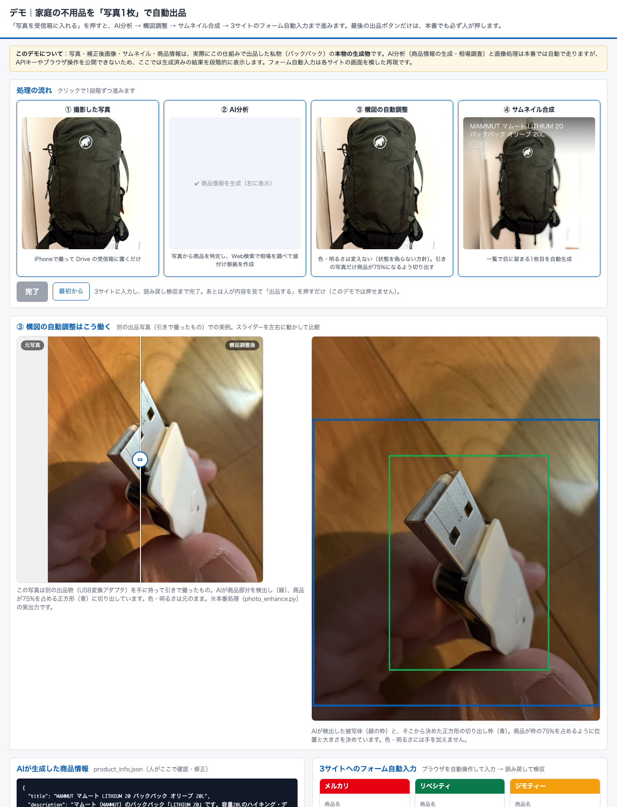
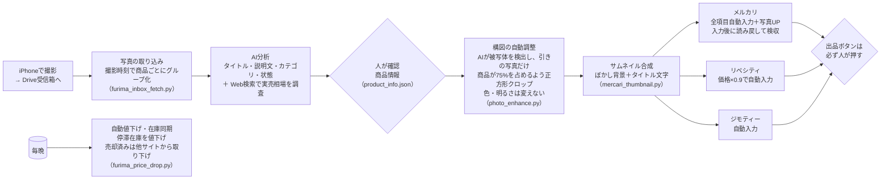

# 04. 家庭の不用品を「写真1枚」で自動出品

| 項目 | 内容 |
|---|---|
| 状態 | 稼働中（出品はオンデマンド／値下げ監視は毎晩） |
| 利用者 | 本人・妻 |
| 入力 | iPhoneで撮った商品写真（Google Driveの受信箱に置くだけ） |
| 出力 | フリマ3サイト（メルカリ／リベシティ／ジモティー）の出品ページ |

> ### ▶ [触って試せるデモを開く](https://nihonbare1979-cmd.github.io/ai-life-automation-showcase/demos/04-flea-market-autolist/)
> 実際にこの仕組みで出品した私物（バックパック）の元写真・AI生成の商品情報・補正後写真・サムネイルを、処理の順に表示し、3サイトのフォーム自動入力を再現します。
> （GitHub Pages で公開。リポジトリ内のファイルは [`demos/04-flea-market-autolist/`](../demos/04-flea-market-autolist/index.html)）

## 実際の画面



*デモ画面：元写真 → AI分析 → 補正 → サムネイル → 3サイトのフォーム入力（すべて本物の生成物）*


## 課題

家庭内の不用品（仕入れを伴わない私物）を売るだけでも、撮影 → 説明文を書く → 相場を調べる → サイトごとに項目を入力する、という作業が1点あたり15〜20分かかり、「売れば数千円になるのに面倒で放置」が常態化していました。

## 仕組み



- **写真は「構図だけ」直す**：AIで被写体を検出し、引きで撮った写真だけ商品が画面の75%を占めるよう正方形にクロップ。色・明るさ・傷の見え方は加工しない（商品の状態を偽らないため。背景ぼかしはフリマサイト側の公式機能を使う方針に統一）
- **人が判断する場所を2箇所に固定**：AIが作った商品情報の確認と、最後の出品ボタン。それ以外は全自動
- **フォーム読み戻し検収**：自動入力のあと、入力内容をページから読み戻して照合する仕組みを追加（入力漏れが根治）
- **値下げの安全弁**：新品・未使用は値下げ対象外、出品後3日間は値下げしない、1,000円未満は送料で赤字になるため停止、下限は元値の半額

## 効果（実測）

- 画像編集から出品までを**完全自動化**。人の作業は「撮る」と「確認」だけ
- 18商品を一括出品（2サイト）した実績、**30点超の一括値下げ**にも対応
- 2026年8月、タイトルに「新品」と書いていない新品を誤って値下げした事故を受け、**商品ページの「状態」欄を実際に読んで判定する**方式に改修

## 使用技術

`Python` `AI Vision（商品分析）` `Web検索（相場調査）` `画像処理（Pillow / rembg）` `ブラウザ自動操作（Chrome）` `常駐監視（launchd）`

## コード抜粋 —— 自動値下げの安全弁（`furima_price_drop.py`）

値下げは「やりすぎると損をする」ので、運用しながら足していったルールがそのままコードになっています。

```python
def calc_floor(price: int) -> int:
    """値下げ下限 = 元値の半額を100円単位に切り上げ（最低300円）"""
    return max(300, math.ceil(price / 2 / 100) * 100)


# 新品・未開封商品は自動値下げ対象外
NEW_ITEM_KEYWORDS = ("新品", "未使用", "未開封")

# 改修: 従来はタイトル文字列だけで新品を判定しており、タイトルに「新品」と
# 書いていない新品を検知できず誤値下げしていた。出品ページの
# 「商品の状態」を実際に読んで判定する。タイトル判定は補助として残す。
MERCARI_NEW_CONDITION = "新品、未使用"
LIBECITY_NEW_CONDITION = "unused"
CONDITION_FETCH_LIMIT = 15  # 1回の実行で商品ページを開いて状態を取りに行く上限

# 出品後3日間は値下げしない／1000円未満は送料で赤字化しうるため値下げ停止
GRACE_DAYS = 3
MIN_DROP_PRICE = 1000


def is_new_item(name: str) -> bool:
    return any(k in name for k in NEW_ITEM_KEYWORDS)


def in_grace_period(entry: dict) -> bool:
    """出品(状態ファイル初回記録)から GRACE_DAYS 日未満なら True。
    added が無い古い記録は猶予期間を過ぎているとみなす"""
    added = entry.get("added")
    if not added:
        return False
    try:
        d = datetime.strptime(added, "%Y-%m-%d")
    except ValueError:
        return False
    return (datetime.now() - d).days < GRACE_DAYS
```

## 出力サンプル

AIが生成する商品情報（`product_info.json`）の形式。人はこれを確認して確定します（内容はダミー）：

```json
{
  "title": "○○ブランド トートバッグ A4対応 ネイビー",
  "condition": "目立った傷や汚れなし",
  "category": "レディース > バッグ > トートバッグ",
  "price": 4800,
  "price_basis": "直近の売り切れ相場 4,200〜5,500円（3件）の中央値",
  "description": "サイズ: 約 W38 × H30 × D12cm。数回使用、目立つ傷なし。..."
}
```

## 運用して学んだこと

- 構図調整の被写体検出には弱点があります。商品全体が画面いっぱいの写真では正しく「クロップ不要」と判断できる一方、CDジャケットやロゴ入りの製品では**印刷された絵柄やロゴを商品と誤認して切り出しすぎる**ことを2026年9月の検証で確認しました。現状は「1枚目の写真は人が必ず確認する」運用で吸収していますが、検出方式の改良（背景推定との併用など）を次の課題として記録しています。**弱点を隠さず、運用で守りながら直す**のが私の進め方です
- **「AIに全部任せる」より「人が押すボタンを2つだけ残す」**方が、家族が安心して使えました。全自動にすると誤出品が怖くて使われません
- 自動値下げの誤動作は「タイトルだけで判断していた」ことが原因でした。**表示上の文言ではなく、システムが持つ構造化データ（状態欄）を読む**方が確実、という教訓はSaaSの運用にもそのまま通じると考えています
