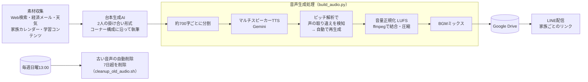

# 05. AI音声ニュース番組の毎朝自動生成

| 項目 | 内容 |
|---|---|
| 状態 | 稼働中（毎朝4:00〜6:15に3番組を生成・2026年7月6日〜） |
| 利用者 | 本人（45分）・妻（30分）・子供（20分） |
| 入力 | なし（完全自動。当日のニュース・経済情報・学習コンテンツ・天気・家族の予定） |
| 出力 | 音声ファイル（m4a）をDriveに保存し、LINEで配信 |

> ### ▶ [実際の番組音声を聴く（75秒）](https://nihonbare1979-cmd.github.io/ai-life-automation-showcase/demos/05-ai-radio/)
> 2026年9月3日に実際に配信した「こども版」から、家族の名前や予定を含まないニュースコーナー1本を切り出したものです。2人の掛け合い台本 → マルチスピーカーTTS → 声の取り違え検証 → 音量正規化、を通過した本物の生成音声です。

## 課題

朝の情報収集に時間を取られる一方、家族それぞれが欲しい情報（大人は経済・AI動向、子供は学習と時事）は違い、1つのニュース番組では全員に合いませんでした。

## 仕組み



- **家族別の3番組**：同じ仕組みで、対象者に合わせて台本のコーナーと長さを変える
- **声の取り違えを自動検知**：2人の話者を合成すると、まれに声が入れ替わる。音声のピッチ（声の高さ）から「女声の比率」を測り、台本から期待される比率とズレたテイクは自動で作り直す
- **締切ガード**：勤務日の朝は7:15までに完成させる必要があるため、間に合わない場合の打ち切り条件を持つ
- **子供版はクラウド実行**：Macを閉じていても動くよう、子供版だけクラウドの定期実行へ移行（2026年8月）

## 効果（実測）

- 45分／30分／20分の3番組を**毎日全自動**で生成
- 運用費は**月額約2,000円**（音声合成API）。大人版は定額サービスの範囲内で追加課金ゼロ
- 音声の自動削除により、Drive容量2.3GB → 494MBに整理（72本）

## 使用技術

`Python` `Gemini API（マルチスピーカーTTS）` `ffmpeg（結合・LUFS正規化・コンプレッサー）` `音声信号処理（自己相関によるピッチ推定）` `Google Drive` `LINE Messaging API` `クラウド定期実行（Claude Code Routines）` `launchd`

## コード抜粋 —— 声の取り違えを検知して再生成（`build_audio.py`）

音声を聞かずに品質を機械判定するために、「台本上の女声の割合」と「実際に生成された音声の女声の割合」を比べています。

```python
def tts_chunk_validated(client, types, chunk: str, out_wav: Path) -> None:
    """ピッチ検証つきTTS生成。取り違え疑いのテイクは再生成し、最良テイクをout_wavに残す"""
    expected = expected_female_ratio(chunk)
    best_diff = None
    take = out_wav.with_suffix(".take.wav")
    for attempt in range(1 + GENDER_MAX_RETRY):
        tts_chunk(client, types, chunk, take)
        diff = abs(measured_female_ratio(take) - expected)
        if best_diff is None or diff < best_diff:
            best_diff = diff
            take.replace(out_wav)
        if diff <= GENDER_RATIO_TOLERANCE:
            break
        if attempt < GENDER_MAX_RETRY:
            print(f"  ⚠ 声の取り違え疑い（女声比率ズレ {diff:.2f}）→ 再生成 {attempt+1}/{GENDER_MAX_RETRY}")
            time.sleep(5)
    else:
        print(f"  ⚠ 検証を通らず。最良テイク（ズレ {best_diff:.2f}）を採用")
    if take.exists():
        take.unlink()


def expected_female_ratio(chunk: str) -> float:
    """台本チャンクから期待される女声の発話比率を文字数ベースで見積もる"""
    female = male = 0
    for line in chunk.splitlines():
        m = re.match(rf"^({'|'.join(SPEAKERS)})[:：](.*)", line.strip())
        if not m:
            continue
        n = len(m.group(2))
        if m.group(1) in FEMALE_SPEAKERS:
            female += n
        else:
            male += n
    total = female + male
    return female / total if total else 0.5
```

較正値（実測）：正常なテイクのズレは0.03、全編取り違えたテイクは0.84、許容しきい値を0.15に設定。

## 出力サンプル

台本の冒頭部分の形式（家族の予定や個人情報を含むため、内容はダミー）：

```
ハル: おはようございます、9月3日水曜日の朝です。
ソウ: 今日の高松は晴れ、最高気温は31度。まだ暑い一日になりそうです。
ハル: さて今日のAIニュース、まずは……
```

## 運用して学んだこと

- 生成AIの出力は「ときどき外れる」ことを前提に、**人が聞かなくても外れを検知できる仕組み**（ピッチ検証）を入れたことで、毎朝の品質が安定しました
- 同じ内容の回を数日おきに繰り返してしまう問題が起き、話題のタグ台帳と再放送禁止期間（21日）を設けて解決。**利用者の「また同じ話だ」という反応をルールに変換する**のが改善の本質でした
