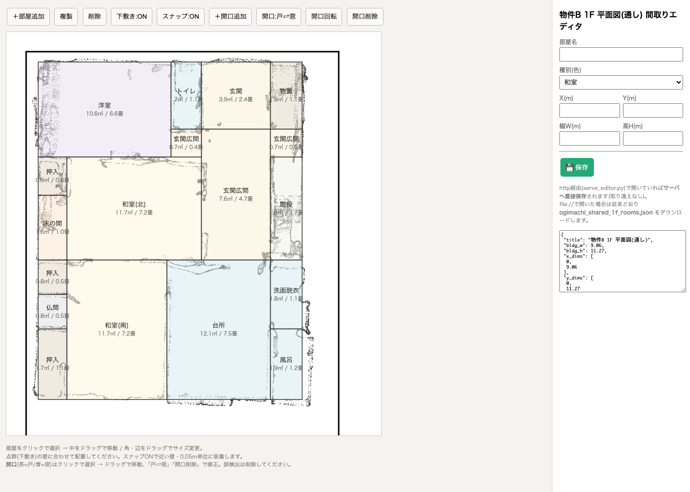
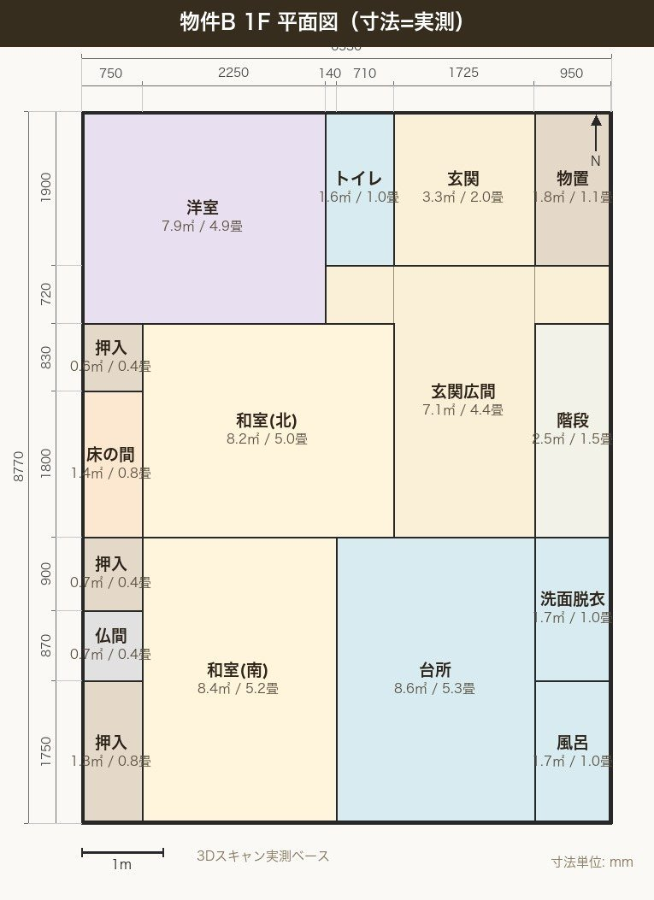
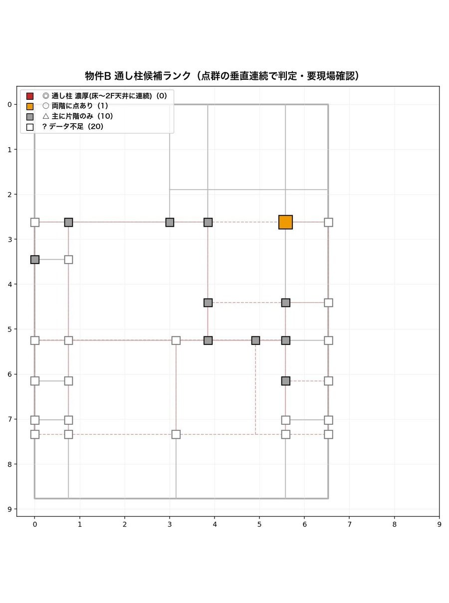
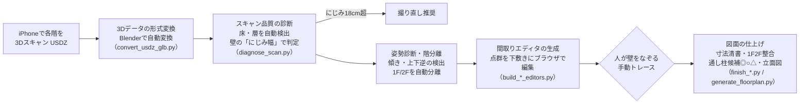

# 06. 3Dスキャン → 寸法入り図面の自動生成（OSS公開）

| 項目 | 内容 |
|---|---|
| 状態 | 完成・公開中 —— **フルソース: [nihonbare1979-cmd/scan-to-floorplan-skill](https://github.com/nihonbare1979-cmd/scan-to-floorplan-skill)** |
| 利用者 | 本人・妻（物件の間取り・構造把握） |
| 入力 | iPhone / iPad（LiDAR）で撮った3Dスキャン（USDZ形式） |
| 出力 | 寸法入り平面図、1階・2階の整合図、通し柱候補の重ね図、立面図（JPG） |

> ### ▶ [触って試せるデモを開く](https://nihonbare1979-cmd.github.io/ai-life-automation-showcase/demos/06-floorplan-editor/)
> 実際の間取りエディタそのものです。3Dスキャンの点群を下敷きに、部屋をドラッグで動かしたり、開口部を追加したりできます（物件名は「物件B」に置換。保存はダウンロードになります）。
> （GitHub Pages で公開。リポジトリ内のファイルは [`demos/06-floorplan-editor/`](../demos/06-floorplan-editor/index.html)）

## 実際の画面



*間取りエディタ：3Dスキャンの点群（グレーのにじみ）を下敷きに、人が部屋の枠をなぞる*



*生成された1F平面図（寸法は3Dスキャンの実測値）*



*通し柱候補のランク図：点群の垂直方向の連続性から◎○△を判定*


## 課題

築古の戸建を検討・改修するとき、間取り図や構造の叩き台が欲しいのに、手で測量して作図するのは時間がかかりすぎました。iPhoneの3Dスキャンは手軽ですが、そのままでは「寸法の入った図面」にはなりません。

## 仕組み



- **品質診断を最初に置く**：スキャン精度が悪いと後工程が全部無駄になるため、壁の「にじみ幅」を測って「良好／注意／撮り直し」を最初に判定
- **推定を図面に載せない**：開口部（ドア・窓）などの自動検出はあえて捨て、人がなぞった事実だけを図面化する方針（誤った図面は無い方がまし）
- **通しスキャン対応**：1回のスキャンに2階分が入っていれば、1F/2Fの位置合わせを3Dデータから自動で行う

## 効果（実測）

- 実物件で検証し、通し柱候補（確度◎）を**27本**抽出。別々にスキャンして手動で合わせる方式では◎が0本だったため、通しスキャン方式に切り替えた
- 品質しきい値（≤12cm良好／12〜18cm注意／>18cm撮り直し）を実測から較正
- 固有の物件情報を取り除き、**汎用パイプラインとしてGitHubに公開**（コード規模 約2,700行）

## 使用技術

`Python` `Blender Python API（ヘッドレス）` `NumPy（点群処理・ヒストグラム解析・FFT相互相関）` `HTMLエディタ（ブラウザで手動トレース）` `画像描画（Pillow）`

## コード抜粋 —— 壁の「にじみ幅」でスキャン品質を判定（`diagnose_scan.py`）

腰の高さで水平に切った点群のヒストグラムを取り、壁のピークの幅（半値幅）を測ります。壁がにじんで太く見えるほどスキャン精度が悪い、という考え方です。

```python
def wall_blur(xy, axis_bins=0.02):
    """腰高スライスの行/列ヒストグラムから壁ピークの幅(FWHM)を測り、
    壁にじみの中央値(m)とピーク一覧を返す。"""
    widths = []
    for ax in (0, 1):
        vals = xy[:, ax]
        lo, hi = np.percentile(vals, [0.5, 99.5])
        nb = max(int((hi - lo) / axis_bins), 50)
        h, e = np.histogram(vals, bins=nb, range=(lo, hi))
        thr = np.percentile(h, 90)
        i = 0
        while i < nb:
            if h[i] >= thr:                       # ピーク帯の開始
                j = i
                while j < nb and h[j] >= thr * 0.5:   # 半値幅で測る
                    j += 1
                widths.append((j - i) * axis_bins)
                i = j
            else:
                i += 1
    widths = [w for w in widths if w >= axis_bins * 2]
    return (float(np.median(widths)) if widths else np.nan), widths
```

## 出力サンプル

上の「実際の画面」に、実物件で生成した1F平面図と通し柱ランク図を掲載しています（物件名のみ「物件B」に置換）。使い方・全生成物の一覧は公開リポジトリのREADMEをご覧ください：
https://github.com/nihonbare1979-cmd/scan-to-floorplan-skill

## 運用して学んだこと

- 最初に作った「開口部の自動検出」は、それらしい図面が出る一方で間違いが混ざり、**間違った図面は無い図面より危険**と判断して白紙撤回しました。自動化の対象は「確実にできること」に絞る、という判断基準がここで固まりました
- 公開にあたって固有名や個人の物件情報を全て取り除く作業を行い、**他人が使える形に整える**ことの手間と価値を学びました
